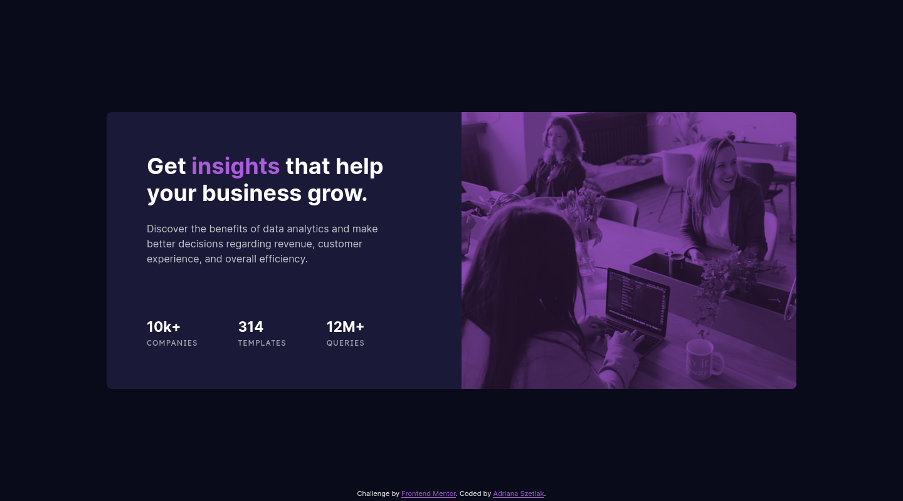

# Frontend Mentor - Stats preview card component solution

This is a solution to the [Stats preview card component challenge on Frontend Mentor](https://www.frontendmentor.io/challenges/stats-preview-card-component-8JqbgoU62).

## Table of contents

- [Overview](#overview)
  - [The challenge](#the-challenge)
  - [Screenshot](#screenshot)
  - [Links](#links)
- [My process](#my-process)
  - [Built with](#built-with)
  - [What I learned](#what-i-learned)
  - [Continued development](#continued-development)
  - [Useful resources](#useful-resources)
- [Author](#author)

**Note: Delete this note and update the table of contents based on what sections you keep.**

## Overview

### The challenge

The goal:

- View the optimal layout depending on their device's screen size

### Screenshot

### Links

- Solution URL: (https://github.com/AdrianaMagdalena/stats-preview-card/)
- Live Site URL: (https://adrianamagdalena.github.io/stats-preview-card/)

## My process

### Built with

- Semantic HTML5 markup
- CSS custom properties
- Flexbox
- CSS Grid
- Mobile-first workflow

### What I learned

-- to be updated --

### Continued development

-- to be updated --

### Useful resources

- [Josh's CSS Reset](https://www.joshwcomeau.com/css/custom-css-reset/) - My go-to CSS Reset template, to make work with CSS simpler and faster

## Author

- Portfolio (not yet finished as per June 9th 2023) - [Adriana Szetlak - Portfolio](https://adrianamagdalena.github.io/portfolio/)
- GitHub - [Adriana Szetlak](https://github.com/AdrianaMagdalena)
- Frontend Mentor - [@AdrianaMagdalena](https://www.frontendmentor.io/profile/AdrianaMagdalena)
